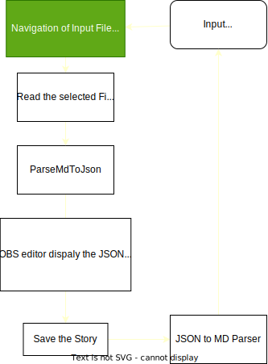
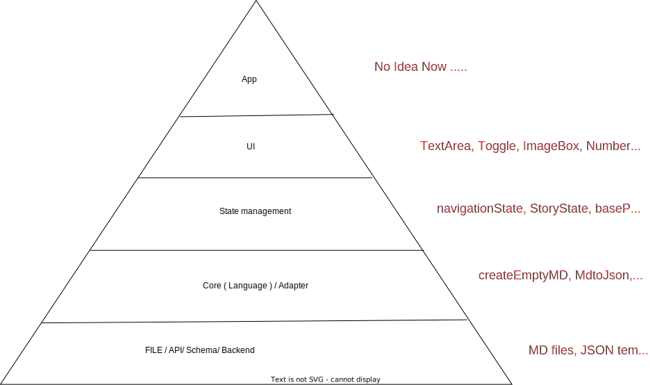

# OBS Standalone App

This is a library package provides UI, state-management, custom hooks and core functions for display and edit open bible story (OBS)

### Tech Stack

- React Js : User Interface and State Management
- pure Js : Core Fucntionality
- vite : Running Example App in devMode
- Styleguidist : Library Demo

### Links

[styleguide](https://standalone-obs-rcl.netlify.app/)

[npm package](https://www.npmjs.com/package/standalone-obs-app)

### Install Library

```
pnpm add standalone-obs-app
```

### UI

- EditorPanle : to edit OBS story

### Custom Hooks

- useStory : handle the state of a single story and actions

### Core Fucntions

- mdToJson : parses OBS markdown (md) string into a story json

## How to run the app

- clone the repo

```
git clone https://github.com/sijumoncy/obs-rcl-test.git
```

### Run in Development Mode

- install packages

```
pnpm install
```

- run the app in development mode to preview the app

```
pnpm run dev
```

- navigate to

```
http://127.0.0.1:5173/
```

### Run in Styleguide

- Run the styleguide

```
pnpm run styleguide
```

- Navigate to

```
http://127.0.0.1:6060/
```

### How to build the Styleguide

```
pnpm run styleguide-build
```

## Diagrams

Flow Diagram



Layers Diagram



Architecture Diagram
